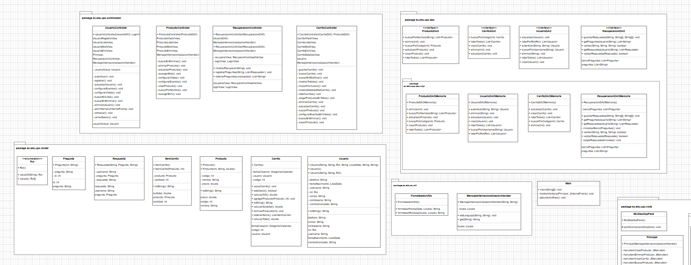
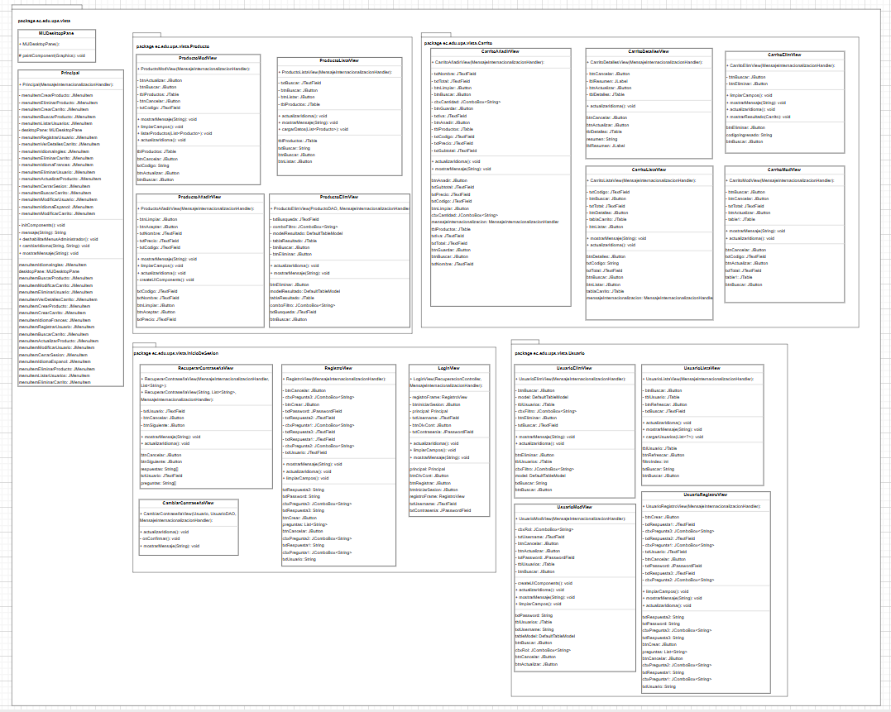

# 🛒 Proyecto de Ejemplo – Carrito de Compras

**Autor:** Sebastian Israel Loza Carbo  

**Fecha:** 2025-07-07

**Carrera:** Ingenieria en Ciencias de la Computación

**Materia:** Programación Orientada a Objetos


Este proyecto fue desarrollado como parte del **Periodo 66** de la asignatura **Programación Orientada a Objetos** en la Universidad Politécnica Salesiana.  
Su objetivo principal es demostrar el uso de **patrones de diseño** en una aplicación Java con interfaz gráfica Swing.

---

## 🎯 Objetivo

Implementar un sistema de carrito de compras que permita a los usuarios:

- Registrar y autenticar usuarios.
- Crear, buscar, actualizar y eliminar productos.
- Armar, modificar, listar y eliminar carritos de compra.
- Recuperar contraseña mediante preguntas de seguridad.
- Cambiar dinámicamente el idioma de la interfaz (español, inglés, francés).

Se sigue una arquitectura **desacoplada** basada en:
- **MVC** (Modelo–Vista–Controlador)
- **DAO** (Data Access Object)
- Principios **SOLID** (SRP, DIP…)

---

## 🛠️ Tecnologías

- **Java 21**
- **Swing** (javax.swing) para UI
- **IntelliJ IDEA** + plugin de diseñador de formularios
- **Maven** o **Gradle** (según configuración)

---

## 🧱 Patrones de Diseño

- **MVC** para separar presentación, lógica de negocio y datos.
- **DAO** para abstraer el acceso a datos en memoria y facilitar migración a BD.
- **Singleton**, **Factory** y **Strategy** (implícitos en el manejo de internacionalización).
- Principios **SOLID** (SRP, OCP, LSP, ISP, DIP).

---

## 📂 Estructura de Carpetas
```
GestionDeCompras/
├── src/
│   └── main/
│       ├── java/
│       │   └── ec/
│       │       └── edu/
│       │           └── ups/
│       │               ├── Main.java
│       │               ├── controlador/
│       │               │   ├── CarritoController.java
│       │               │   ├── ProductoController.java
│       │               │   ├── RecuperacionController.java
│       │               │   └── UsuarioController.java
│       │               ├── dao/
│       │               │   ├── CarritoDAO.java
│       │               │   ├── ProductoDAO.java
│       │               │   ├── RecuperacionDAO.java
│       │               │   ├── UsuarioDAO.java
│       │               │   └── impl/
│       │               │       ├── CarritoDAOMemoria.java
│       │               │       ├── ProductoDAOMemoria.java
│       │               │       ├── RecuperacionDAOMemoria.java
│       │               │       └── UsuarioDAOMemoria.java
│       │               ├── modelo/
│       │               │   ├── Carrito.java
│       │               │   ├── ItemCarrito.java
│       │               │   ├── Pregunta.java
│       │               │   ├── Producto.java
│       │               │   ├── Respuesta.java
│       │               │   ├── Rol.java
│       │               │   └── Usuario.java
│       │               ├── util/
│       │               │   ├── FormateadorUtils.java
│       │               │   └── MensajeInternacionalizacionHandler.java
│       │               └── vista/
│       │                   ├── Carrito/
│       │                   │   ├── CarritoAñadirView.java
│       │                   │   ├── CarritoDetallesView.java
│       │                   │   ├── CarritoElimView.java
│       │                   │   ├── CarritoListaView.java
│       │                   │   └── CarritoModView.java
│       │                   ├── InicioDeSesion/
│       │                   │   ├── CambiarContraseñaView.java
│       │                   │   ├── LoginView.java
│       │                   │   ├── RecuperarContraseñaView.java
│       │                   │   └── RegistroView.java
│       │                   ├── Producto/
│       │                   │   ├── ProductoAñadirView.java
│       │                   │   ├── ProductoElimView.java
│       │                   │   ├── ProductoListaView.java
│       │                   │   └── ProductoModView.java
│       │                   ├── Usuario/
│       │                   │   ├── UsuarioElimView.java
│       │                   │   ├── UsuarioListaView.java
│       │                   │   ├── UsuarioModView.java
│       │                   │   └── UsuarioRegistroView.java
│       │                   ├── MiJDesktopPane.java
│       │                   └── Principal.java
│       └── resources/
│           └── mensajes/
│               ├── mensajes_es_EC.properties
│               ├── mensajes_en_US.properties
│               └── mensajes_fr_FR.properties
└── .idea/
```
---

## 📖 Cómo ejecutar

1. **Clonar** el repositorio.
2. Importar en IntelliJ IDEA (como proyecto Maven/Gradle).
3. Ejecutar la clase `ec.edu.ups.Main`.
4. Iniciar sesión con un usuario creado o registrar uno nuevo.
5. Explorar menús de **Producto**, **Carrito** y **Usuario** en la ventana principal.

---

## 📊 Diagramas UML


*Diagrama de clases: muestra entidades, relaciones y métodos principales.*


*Diagrama de secuencia: flujo de creación de carrito de compras.*

---
## Link de repositorio

https://github.com/SebasLzCb/ec.edu.ups.GestionDeCompras.git

---

## 💡 Recomendaciones

- Pruebas con distintos idiomas para ver la internacionalización.
- Sustituir las implementaciones en memoria por DAO que usen JDBC o JPA.
- Añadir validaciones adicionales en formularios (formato de correo, longitud de campos).
- Integrar pruebas unitarias con JUnit para DAO y lógica de negocio.

---

## © Créditos

Universidad Politécnica Salesiana – **Programación Orientada a Objetos** (Periodo 66)  
Desarrollado por: Sebastian Israel Loza Carbo  
2025 – https://ups.edu.ec  